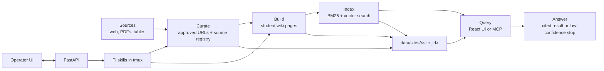

# Ultra Fast RAG

Local operator app for building a student-focused LLM Wiki from university web pages, PDFs, and other source artifacts. It helps an operator discover sources, curate what matters, scrape and normalize content, build wiki pages, index them, and expose cited answers through the app or a local MCP server.


## What It Is

- **Operator UI:** React + Vite workspace for site health, sources, runs, wiki builds, embeddings, MCP, metrics, and settings.
- **Local API:** FastAPI control layer for site state, jobs, artifacts, and status.
- **Agent jobs:** Pi skills launched in tmux for long-running discovery, curation, and wiki compilation.
- **Query surface:** Local MCP server over pre-built `data/sites/<site_id>/` wiki pages and indexes.
- **PDF path:** MarkItDown-based PDF ingest stays on the operator/build side; production query reads already-built wiki/index data.

## Source To Answer



## Local Startup

```bash
python3 -m venv .venv
source .venv/bin/activate
pip install -r requirements.txt -r requirements-pdf.txt -r requirements-mcp.txt
cd frontend
npm install
cd ..
./start.sh
```

Open:

- UI: `http://127.0.0.1:5173`
- API health: `http://127.0.0.1:8000/api/health`

Useful local commands:

```bash
./status.sh
./stop.sh
tmux attach -t ultra-fast-rag-webapp
./scripts/verify-webapp.sh
```

## Docker

The Docker image is the full operator app: API, static UI, and Python dependencies including `requirements-pdf.txt` with MarkItDown for refresh workflows. Query-only production can run MCP against a mounted pre-built `data/sites/<site_id>/` without re-scraping or re-ingesting PDFs.

```bash
docker compose build
docker compose up -d
./scripts/docker-smoke.sh
docker compose ps
docker compose logs -f
```

Open `http://127.0.0.1:8000` for the container-served UI/API.
If local dev already owns port `8000`, use `WEBAPP_HOST_PORT=8013 DOCKER_SMOKE_BASE_URL=http://127.0.0.1:8013`.

## Data And Runtime State

Runtime state lives under `data/sites/<site_id>/`:

```text
discovered_urls.json
approved_urls.md
raw_sources/registry.jsonl
wiki/pages/
wiki/reports/
indexes/llm_wiki_documents.jsonl
indexes/llm_wiki_postings.json
indexes/llm_wiki_manifest.json
metrics/
```

`data/` can become large and is intentionally treated as runtime state, not product source.

## Project Map

```text
frontend/                    React + Vite operator UI
src/scrape_planner/webapp/   FastAPI routes and payload builders
src/scrape_planner/app/      App repositories, contracts, Pi job launcher
src/scrape_planner/scrape/   Discovery, URL selection, scrape worker
src/scrape_planner/pdf/      PDF ingest contracts and MarkItDown pipeline
src/scrape_planner/sources/  Raw source registry, normalization, quality gates
src/scrape_planner/wiki/     Wiki build, index, confidence, query path
src/scrape_planner/index/    Embedding clients and vector index support
src/scrape_planner/runtime/  Run persistence, analytics, metrics
src/scrape_planner/infra/    tmux and process runners
mcp_servers/                 Local MCP entrypoints
.pi/skills/                  Operator skills launched from the UI
```

## Deeper Docs

- [Documentation index](docs/README.md)
- [Codebase map](docs/CODEBASE.md)
- [Cursor MCP setup](docs/cursor-mcp-setup.md)
- [OpenSpec quickstart](docs/openspec/opsx-quickstart.md)
- [Agent operating guide](AGENTS.md)

## Design Principles

- Local first.
- Evidence over guesses.
- Student-actionable content over broad site mirroring.
- Thin API routes, durable artifacts, inspectable jobs.
- Agent skills own long-running wiki work; FastAPI launches and reports.
- Graceful failure beats silent hallucination.
