# Ultra Fast RAG

Local operator workspace for turning university web, PDF, and tabular sources into a student-focused LLM Wiki with searchable evidence, agent-run jobs, embeddings, metrics, and a query-only MCP server.

Built for one job: help an operator build and maintain a local, cited knowledge base for a school site without guessing from stale pages.

## What It Does

- Creates per-site workspaces under `data/sites/<site_id>/`.
- Discovers site URLs from sitemaps and curated seeds.
- Curates approved scrape URLs with editable Markdown review.
- Scrapes approved web pages into raw Markdown artifacts.
- Normalizes web, PDF, and spreadsheet inputs into a shared source registry.
- Builds student-actionable wiki pages from normalized sources.
- Lints, indexes, and queries the wiki with hybrid BM25/vector retrieval.
- Runs site jobs through Pi skills in tmux, with live status in the UI.
- Tracks run history, token use, embedding use, timings, cost health, and rolling metrics.
- Starts and stops a query-only MCP server for the active site index.
- Shows source, document, wiki, embedding, MCP, tmux, and run status from one React operator UI.

## App Surfaces

| Surface | Purpose |
| --- | --- |
| React UI | Operator workspace at `http://127.0.0.1:5173` |
| FastAPI API | Local API at `http://127.0.0.1:8000` |
| Pi skills | Long-running discovery, curation, and wiki-build jobs |
| tmux | Process isolation and live log/session recovery |
| MCP server | Agent-facing local wiki/source query tools |
| Data root | Runtime artifacts, source registry, wiki pages, indexes, metrics |

## Operator Workflow

1. Open or discover a university site workspace.
2. Review discovered URLs and curate `approved_urls.md`.
3. Scrape approved URLs into run artifacts.
4. Normalize web/PDF/tabular artifacts into `raw_sources/registry.jsonl`.
5. Build the LLM Wiki with the `llm-wiki-noninteractive` Pi skill.
6. Rebuild embeddings and hybrid indexes.
7. Start MCP for agent access to local query tools.
8. Use metrics, run history, source previews, and wiki status to decide what needs refresh.

## UI Tabs

| Tab | What it shows |
| --- | --- |
| Overview | Site health, ready source count, wiki status, index status, current activity |
| Sources | Source registry summaries, approved URL editing, curation actions |
| Runs | Scrape run history, run events, page states |
| Documents | Raw source and document previews grouped by source type |
| Wiki | Wiki build controls, Pi/tmux events, wiki generation status, page browser |
| Embeddings | Index counts, rebuild controls, embedding job status and logs |
| MCP | Start/stop status for the site-scoped `llm-wiki` MCP server |
| Metrics | Per-run and rolling agent/embedding token, timing, and cost summaries |
| Settings | Provider/model settings, scrape settings, wiki runtime, tmux lifecycle |

## Architecture

```mermaid
flowchart LR
    inputs["1. Source inputs<br/>Website URLs<br/>PDFs<br/>Spreadsheets"]
    approve["2. Approve what matters<br/>discovered_urls.json<br/>approved_urls.md"]
    raw["3. Scrape + normalize<br/>Clean source registry<br/>raw_sources/registry.jsonl"]
    wiki["4. Build student wiki<br/>Student-focused pages<br/>wiki/pages"]
    index["5. Build search index<br/>BM25 + dense vectors<br/>indexes"]
    query["6. Ask questions<br/>React UI or MCP"]
    answer["7. Get result<br/>Cited answer<br/>or low-confidence response"]

    inputs --> approve --> raw --> wiki --> index --> query --> answer

    ui["Operator UI<br/>starts jobs + shows status"]
    api["FastAPI<br/>thin control layer"]
    jobs["tmux jobs<br/>discovery / curation / wiki build"]
    store["Site workspace<br/>data/sites/{site_id}"]

    ui <--> api
    api --> jobs
    jobs --> approve
    jobs --> wiki
    raw --> store
    wiki --> store
    index --> store
    store --> query

    classDef main fill:#eef6ff,stroke:#2563eb,stroke-width:1px,color:#102a43
    classDef control fill:#f4f0ff,stroke:#7c3aed,stroke-width:1px,color:#251047
    classDef store fill:#ecfdf5,stroke:#059669,stroke-width:1px,color:#052e1a

    class inputs,approve,raw,wiki,index,query,answer main
    class ui,api,jobs control
    class store store
```



Read it left to right:

1. Sources come in.
2. Operator approves useful URLs.
3. App scrapes and normalizes sources.
4. Wiki build turns sources into student-facing pages.
5. Index build makes pages and sources searchable.
6. UI or MCP asks questions against the local index.
7. App returns cited answers, or says confidence is low.

```text
frontend/                    React + Vite operator UI
src/scrape_planner/webapp/   FastAPI routes and payload builders
src/scrape_planner/app/      App repositories, contracts, Pi job launcher
src/scrape_planner/scrape/   Discovery, URL selection, scrape worker
src/scrape_planner/pdf/      PDF ingest contracts and Docling pipeline
src/scrape_planner/sources/  Raw source registry, normalization, quality gates
src/scrape_planner/wiki/     Wiki build, index, confidence, self-improving query path
src/scrape_planner/index/    Embedding clients and vector index support
src/scrape_planner/runtime/  Run persistence, analytics, metrics
src/scrape_planner/infra/    tmux and process runners
mcp_servers/                 Local MCP entrypoints
.pi/skills/                  Operator skills launched from the UI
```

See [docs/CODEBASE.md](docs/CODEBASE.md) for the detailed module map.

## Documentation

| Guide | Description |
| --- | --- |
| [docs/README.md](docs/README.md) | Full documentation index |
| [docs/CODEBASE.md](docs/CODEBASE.md) | Python package map |
| [docs/cursor-mcp-setup.md](docs/cursor-mcp-setup.md) | MCP install and production query |
| [docs/planning/work-index.md](docs/planning/work-index.md) | Ralph spec queue (agents) |
| [docs/openspec/opsx-quickstart.md](docs/openspec/opsx-quickstart.md) | OpenSpec change workflow |

## Operator Skills

The webapp exposes these Pi skills through `POST /api/sites/{site_id}/jobs`:

| Skill | Purpose |
| --- | --- |
| `site-discovery` | Discover sitemap URLs and write `discovered_urls.json` |
| `site-url-curation` | Curate `approved_urls.md` from the discovery pool |
| `llm-wiki-noninteractive` | Compile wiki pages, lint, and rebuild the hybrid index |

Jobs run in tmux. Reports and logs stay under the site workspace so failed or stale sessions can be inspected, archived, or killed.

## Quickstart

```bash
python3 -m venv .venv
source .venv/bin/activate
pip install -r requirements.txt -r requirements-pdf.txt -r requirements-mcp.txt
cd frontend
npm install
cd ..
./start.sh
```

Open:

- UI: `http://127.0.0.1:5173`
- API health: `http://127.0.0.1:8000/api/health`

Useful commands:

```bash
./status.sh
./stop.sh
tmux attach -t ultra-fast-rag-webapp
./scripts/verify-webapp.sh
```

`./start.sh` starts React and FastAPI through tmux when tmux is available. It writes runtime env details under `logs/`.

## Configuration

| Variable | Purpose |
| --- | --- |
| `SCRAPE_PLANNER_DATA_ROOT` | Override default runtime data root |
| `REDIS_URL` | Optional Redis state backend, default `redis://localhost:6379/0` |
| `OLLAMA_BASE_URL` | Local embedding/model host when used |
| `OLLAMA_EMBED_MODEL` | Dense embedding model, default `nomic-embed-text:latest` |
| `OPENROUTER_API_KEY` | Optional reranking, reasoning, or enrichment provider |
| `TAVILY_API_KEY` | Optional external research provider |
| `WEBAPP_USE_TMUX` | Set `0` to use nohup instead of tmux for app startup |

## Data Layout

Runtime state lives under:

```text
data/sites/<site_id>/
```

Important paths:

```text
discovered_urls.json
approved_urls.md
<run_id>/scrape_manifest.json
<run_id>/pages.jsonl
<run_id>/markdown/*.md
<run_id>/metadata/*.json
sources/pdf_uploads/
sources/pdf_pages/
raw_sources/registry.jsonl
wiki/pages/
wiki/reports/
indexes/llm_wiki_documents.jsonl
indexes/llm_wiki_postings.json
indexes/llm_wiki_manifest.json
indexes/mcp-server-latest.json
metrics/
```

`data/` is runtime state and can become large. It is intentionally not source code.

## Local operator vs production

| Mode | Where it runs | What you install | What runs day to day |
| --- | --- | --- | --- |
| **Local operator** | Laptop / dev machine | `requirements.txt` + `requirements-pdf.txt` (Docling) + `requirements-mcp.txt` + frontend | Full app: scrape, PDF ingest, wiki build, index rebuild, Pi jobs, MCP |
| **Production query** | Small host or your Cursor machine | `requirements-mcp.txt` at minimum; same venv as local is fine | **MCP + LLM APIs** over **pre-built** `data/sites/<site_id>/` — no rescrape, no Docling, no Pi |

**Docling stays in the project** (`requirements-pdf.txt`, Docker image) so the operator app can parse PDFs, normalize sources, and rebuild indexes when you refresh content. Production assumes that work is **already done**; the prod path only **reads** wiki pages and hybrid index files.

Build once (local or a build host), then ship runtime data:

```text
data/sites/<site_id>/
  wiki/pages/          # student wiki markdown
  indexes/             # llm_wiki_*.json(l) hybrid index
  indexes/mcp-server-latest.json   # optional UI MCP status
```

You do **not** need original PDFs, `sources/pdf_ingest/`, or scrape runs on the production query path if the index and wiki already contain the evidence.

## MCP (local and production)

Primary MCP server:

```text
mcp_servers/llm_wiki_mcp.py
```

Tools exposed:

| Tool | Purpose |
| --- | --- |
| `index_info` | Index health, counts, and build metadata |
| `query_wiki` | Hybrid wiki/source retrieval evidence |
| `search_sources` | Raw source evidence only |
| `get_wiki_page` | Fetch a wiki page by path, id, or title |
| `answer_question` | Local cited answer path with confidence checks |
| `ingest_url` | Queue one manual URL ingest (operator refresh; skip in read-only prod) |

Install Cursor MCP config:

```bash
./scripts/install-cursor-mcp.sh
```

See `docs/cursor-mcp-setup.md` and `configs/cursor-mcp-llm-wiki.example.json`.

### Using MCP in production

Production means: **indexes and wiki pages exist**, and agents **query** them through MCP. The LLM that answers the user lives in **Cursor** (or your API product); MCP supplies **evidence and page text**, not Docling or wiki compilation.

1. **Finish the build on an operator machine** (discovery → scrape → PDF ingest with Docling → wiki build → embedding/index rebuild). Confirm `indexes/llm_wiki_manifest.json` exists and `index_info` reports a healthy wiki index count.
2. **Copy or mount** `data/sites/<site_id>/` to the machine where MCP runs (prod VM, or your laptop with a synced copy). `SCRAPE_PLANNER_DATA_ROOT` must point at the parent `data/` directory if you relocate it.
3. **Install MCP deps** on that machine (full venv is OK; minimum is `pip install -r requirements-mcp.txt` plus app imports from the repo).
4. **Wire Cursor MCP** with an absolute `--site-root` to that site folder:

   ```bash
   LLM_WIKI_SITE_ID=www.smu.edu ./scripts/install-cursor-mcp.sh
   ```

   Or merge `configs/cursor-mcp-llm-wiki.example.json` into `~/.cursor/mcp.json` with production paths.
5. **Set API keys for query-time quality** (no local Ollama required on a tiny prod box if the index was built with dense embeddings):

   | Variable | Production use |
   | --- | --- |
   | `OPENROUTER_API_KEY` | Hybrid rerank over retrieved evidence |
   | `OLLAMA_BASE_URL` / `OLLAMA_EMBED_MODEL` | Only if you must embed **new** queries and the index expects Ollama-sized vectors |
   | `TAVILY_API_KEY` | Optional; only if you use `answer_question` web fallback |

6. In Cursor: **Settings → MCP** → enable `llm-wiki-<site_id>` → **reload window**.
7. **Ask questions** with tools, for example:
   - `query_wiki` — cited snippets from the hybrid index (primary prod path).
   - `get_wiki_page` — full markdown for a topic page.
   - `search_sources` — raw source rows when you need catalog/PDF evidence ids.
   - Prefer **not** calling `ingest_url` / relying on `answer_question` auto-ingest on a read-only prod dataset unless you intentionally run the full operator stack again.

Terminal smoke test (same as production MCP process):

```bash
SITE="/path/to/data/sites/www.smu.edu"
PY="/path/to/ultra-fast-rag/.venv/bin/python"
cd /path/to/ultra-fast-rag
printf '%s\n' \
  '{"jsonrpc":"2.0","id":1,"method":"initialize","params":{}}' \
  '{"jsonrpc":"2.0","id":2,"method":"tools/call","params":{"name":"index_info","arguments":{}}}' \
| PYTHONPATH=. OPENROUTER_API_KEY="${OPENROUTER_API_KEY:-}" "$PY" -m mcp_servers.llm_wiki_mcp --site-root "$SITE"
```

Expect `"ok": true` and non-zero index counts. Then call `query_wiki` with a student question and use `get_wiki_page` for pages returned in evidence.

**Production host sizing:** a small VM can hold only `data/` plus Python MCP (hundreds of MB RAM). Docling/torch belong on the **build** machine or the full Docker image when you refresh content—not on a read-only query instance.

**Optional FastAPI container:** `docker compose up` serves the React operator UI and API on port 8000 with Docling included so the **app still works** for refreshes; for prod query-only you can run MCP alone and skip exposing the UI.

## API Highlights

| Endpoint | Purpose |
| --- | --- |
| `GET /api/health` | Backend health and data root |
| `GET /api/sites` | Site workspace list |
| `GET /api/sites/{site_id}/overview` | Compact site health snapshot |
| `GET /api/operator/skills` | Registered Pi skills |
| `POST /api/sites/{site_id}/jobs` | Start a Pi skill job |
| `POST /api/sites/{site_id}/scrape` | Start a scrape run |
| `GET /api/sites/{site_id}/sources` | Source registry rows |
| `GET /api/sites/{site_id}/wiki/pages` | Wiki page browser data |
| `POST /api/sites/{site_id}/embeddings/rebuild` | Rebuild embeddings/index state |
| `POST /api/sites/{site_id}/mcp/start` | Start query MCP in tmux |
| `GET /api/sites/{site_id}/metrics/rollups` | Rolling metrics windows |
| `GET /api/stream/sites/{site_id}` | Server-sent site updates |

## Verification

Main webapp gate:

```bash
./scripts/verify-webapp.sh
```

It runs:

- Python compile checks for webapp/job modules.
- `tests/test_webapp_api.py`.
- Frontend TypeScript and Vite build.

Useful targeted checks:

```bash
.venv/bin/python -m py_compile src/scrape_planner/wiki/llm_wiki_index.py
.venv/bin/pytest tests/test_llm_wiki_mcp.py
cd frontend && npm run build
```

## Docker (full operator app)

The image installs **all** Python deps (`requirements.txt`, `requirements-pdf.txt` with **Docling**, `requirements-mcp.txt`) so PDF ingest and the rest of the pipeline work when you need to refresh data—not because production query requires Docling on every request.

Build and run on port **8000** (API + static UI from one container):

```bash
docker compose build
docker compose up -d
./scripts/docker-smoke.sh
```

Open `http://127.0.0.1:8000`. Mount `./data` so pre-built `data/sites/<site_id>/` indexes and wiki pages are available inside the container.

| Docker use | Docling in image? | Typical workload |
| --- | --- | --- |
| Operator refresh in container | Yes | Scrape, PDF ingest, wiki/index rebuild |
| Production query only | Installed but unused at runtime | Serve UI/API or run MCP against mounted `data/` |

Local dev without Docker still uses `./start.sh` (Vite on **5173**, API on **8000**).

## Current Limits

- Docker images do not include **Pi** or **tmux**; long Pi jobs still use host `./start.sh` unless you run them another way.
- Cursor MCP is **stdio-local** to the machine in `mcp.json`; production usually means syncing `data/sites/<site_id>/` to that host or running MCP where Cursor can reach the repo.
- Embeddings require a healthy dense embedding backend at **index build** time; query-time embedding must match the index (or use BM25/degraded mode). Hash fallback indexes are treated as degraded.
- MCP answers are local-index first. External web fallback only works when provider config and budgets allow it.
- Student wiki quality depends on build-time discovery, curation, normalization, and rebuild freshness—not on prod hardware.

## Design Principles

- Local first.
- Evidence over guesses.
- Student-actionable content over broad site mirroring.
- Thin API routes, durable artifacts, inspectable jobs.
- Agent skills own long-running wiki work; FastAPI launches and reports.
- Graceful failure beats silent hallucination.
