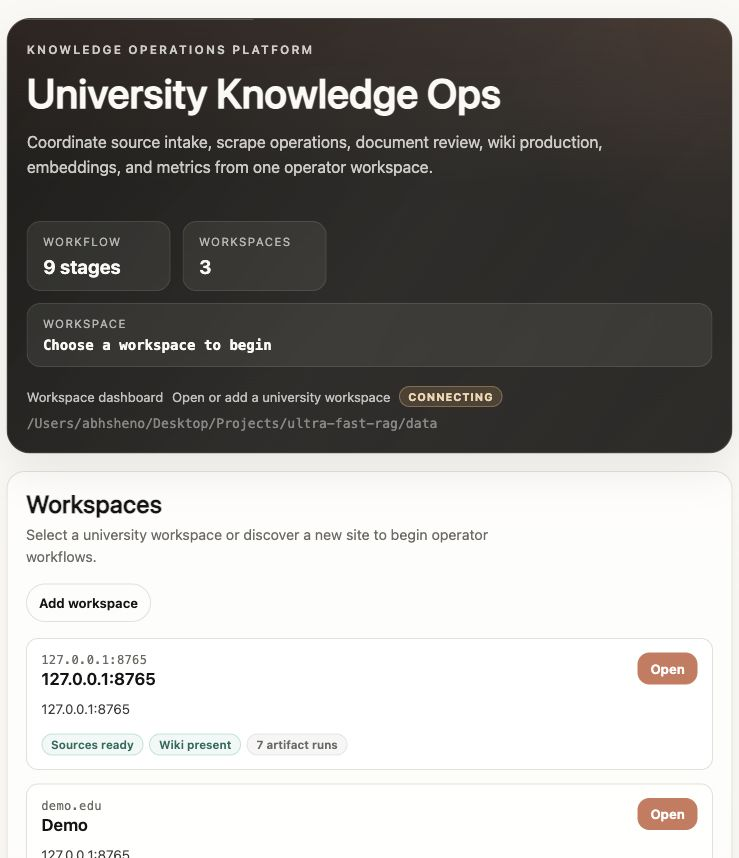
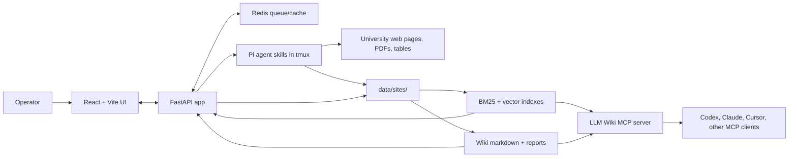

# Ultra Fast RAG

Ultra Fast RAG is a local-first operator app for building a student-focused LLM Wiki from university web pages, PDFs, and other source artifacts. It gives an operator one place to discover sources, approve what matters, scrape and normalize content, compile wiki pages, build retrieval indexes, inspect jobs, and expose cited answers through the web app or a local MCP server.



## Architecture



The Docker image contains the production web server, API, static UI, Python runtime, PDF dependencies, MCP dependencies, and the Pi CLI used by the operator skills. Runtime state is mounted at `/app/data`.

## Main Runtime Paths

```text
frontend/                    React + Vite operator UI
src/scrape_planner/webapp/   FastAPI routes and payload builders
src/scrape_planner/app/      Repositories, artifact contracts, job launchers
src/scrape_planner/scrape/   Discovery, URL selection, scrape workers
src/scrape_planner/pdf/      PDF ingest and MarkItDown pipeline
src/scrape_planner/sources/  Raw source registry, normalization, quality gates
src/scrape_planner/wiki/     Wiki build, index, confidence, query path
src/scrape_planner/index/    Embedding clients and vector index support
src/scrape_planner/runtime/  Run persistence, analytics, metrics
mcp_servers/                 Local MCP entrypoints
.pi/skills/                  Operator skills launched from the UI
test-fixtures/scrape-docs-site/  Separate static site container for scrape tests
data/sites/<site_id>/        Runtime artifacts for each university
```

Important site artifacts:

```text
discovered_urls.json
approved_urls.md
raw_sources/registry.jsonl
runs/
wiki/pages/
wiki/reports/
indexes/llm_wiki_documents.jsonl
indexes/llm_wiki_postings.json
indexes/llm_wiki_manifest.json
metrics/events.jsonl
jobs/reports/
```

## Build And Run In Development

Use local development when you are changing Python, TypeScript, operator UI behavior, or wiki/index logic.

```bash
python3 -m venv .venv
source .venv/bin/activate
pip install -r requirements.txt -r requirements-pdf.txt -r requirements-mcp.txt

cd frontend
npm install
cd ..

./start.sh
```

Open:

- UI: `http://127.0.0.1:5173`
- API health: `http://127.0.0.1:8000/api/health`

Useful local commands:

```bash
./status.sh
./stop.sh
tmux attach -t ultra-fast-rag-webapp
./scripts/verify-webapp.sh
```

Development verification:

```bash
cd frontend && npx tsc --noEmit && npm run build
cd ..
python -m py_compile mcp_servers/llm_wiki_mcp.py
pytest tests/test_webapp_api.py tests/test_llm_wiki_index.py
```

## End-To-End Scrape Testing

Do not bake test data into the app container. End-to-end scrape testing uses a separate static site container that serves synthetic university pages over HTTP. The fixture lives under `test-fixtures/`, is excluded by `.dockerignore`, and is not copied into `/app` when the production image is built.

Start only the scrape fixture:

```bash
PATH=/Applications/Docker.app/Contents/Resources/bin:$PATH \
docker compose -f docker-compose.scrape-test.yml up -d --build
```

Open the fixture site from the host:

```text
http://127.0.0.1:8766
```

Check fixture health:

```bash
curl -sS http://127.0.0.1:8766/healthz
curl -sS http://127.0.0.1:8766/sitemap.xml
```

When the app also runs in Docker, start both Compose files in the same project so the app container can reach the fixture by service name:

```bash
PATH=/Applications/Docker.app/Contents/Resources/bin:$PATH \
WEBAPP_HOST_PORT=18080 \
docker compose -f docker-compose.yml -f docker-compose.scrape-test.yml up -d --build
```

Use these seed URLs:

```text
Host app or browser:      http://127.0.0.1:8766
Docker app container:    http://scrape-docs:8080
Sitemap from container:  http://scrape-docs:8080/sitemap.xml
```

This exercises discovery, URL curation, scraping, source normalization, wiki build, embeddings, and MCP readiness from source pages. It intentionally does not provide pre-built `data/sites/*` artifacts.

Stop the scrape fixture:

```bash
PATH=/Applications/Docker.app/Contents/Resources/bin:$PATH \
docker compose -f docker-compose.scrape-test.yml down
```

## Production With Docker

Use Docker when you want the deployable shape: one app container plus Redis, with all runtime artifacts mounted into `/app/data`.

Build and start:

```bash
PATH=/Applications/Docker.app/Contents/Resources/bin:$PATH docker compose build
PATH=/Applications/Docker.app/Contents/Resources/bin:$PATH docker compose up -d
```

Open:

```text
http://127.0.0.1:8000
```

Use a different host port when local development already owns `8000`:

```bash
WEBAPP_HOST_PORT=18080 \
PATH=/Applications/Docker.app/Contents/Resources/bin:$PATH \
docker compose up -d
```

Mount a different data directory:

```bash
DATA_HOST_DIR=/absolute/path/to/ultra-fast-rag-data \
PATH=/Applications/Docker.app/Contents/Resources/bin:$PATH \
docker compose up -d
```

Pass runtime provider keys only through the environment or a local `.env` file that is not committed:

```bash
OPENROUTER_API_KEY=... \
TAVILY_API_KEY=... \
GEMINI_API_KEY=... \
PATH=/Applications/Docker.app/Contents/Resources/bin:$PATH \
docker compose up -d
```

Docker health and logs:

```bash
PATH=/Applications/Docker.app/Contents/Resources/bin:$PATH docker compose ps
PATH=/Applications/Docker.app/Contents/Resources/bin:$PATH docker compose logs -f app
DOCKER_SMOKE_BASE_URL=http://127.0.0.1:8000 ./scripts/docker-smoke.sh
```

`PI_OFFLINE=1` is the default Docker setting so the container can boot and smoke-test without spending provider tokens. Set `PI_OFFLINE=0` and provide the needed keys when you intentionally want live Pi-agent work from the container.

## MCP Server

The local MCP server is:

```bash
python -m mcp_servers.llm_wiki_mcp --data-root /path/to/data
```

For a single pre-built site:

```bash
python -m mcp_servers.llm_wiki_mcp --site-root /path/to/data/sites/<site_id>
```

The server exposes:

| Tool | Purpose |
| --- | --- |
| `list_universities` | List available sites in data-root mode |
| `index_info` | Check index health and counts |
| `query_wiki` | Search wiki and raw-source evidence |
| `search_sources` | Search raw source registry evidence |
| `get_wiki_page` | Fetch a wiki page by path, id, or title |
| `answer_question` | Evidence-backed answer helper |
| `ingest_url` | Operator refresh path for a single URL |

MCP supports local stdio servers and Streamable HTTP servers. This repo uses stdio for local clients: the client launches the Python module as a subprocess and communicates over stdin/stdout.

### Install MCP In Codex

Codex stores MCP config in `~/.codex/config.toml` or a trusted project-scoped `.codex/config.toml`. Add the server with the CLI from the repo root:

```bash
cd /Users/abhsheno/Desktop/Projects/ultra-fast-rag
codex mcp add llm-wiki \
  --env PYTHONPATH=/Users/abhsheno/Desktop/Projects/ultra-fast-rag \
  -- /Users/abhsheno/Desktop/Projects/ultra-fast-rag/.venv/bin/python \
  -m mcp_servers.llm_wiki_mcp \
  --data-root /Users/abhsheno/Desktop/Projects/ultra-fast-rag/data
```

Equivalent `config.toml`:

```toml
[mcp_servers.llm-wiki]
command = "/Users/abhsheno/Desktop/Projects/ultra-fast-rag/.venv/bin/python"
args = [
  "-m",
  "mcp_servers.llm_wiki_mcp",
  "--data-root",
  "/Users/abhsheno/Desktop/Projects/ultra-fast-rag/data",
]
cwd = "/Users/abhsheno/Desktop/Projects/ultra-fast-rag"
env_vars = ["OPENROUTER_API_KEY"]
startup_timeout_sec = 20
tool_timeout_sec = 60

[mcp_servers.llm-wiki.env]
PYTHONPATH = "/Users/abhsheno/Desktop/Projects/ultra-fast-rag"
```

In the Codex TUI, run `/mcp` to confirm the server is active.

### Install MCP In Claude Code

Claude Code can add a local stdio MCP server with `claude mcp add`. Use project scope when you want the config shared through a project `.mcp.json`; use local or user scope for private machine config.

```bash
cd /Users/abhsheno/Desktop/Projects/ultra-fast-rag
claude mcp add llm-wiki \
  --scope local \
  --env PYTHONPATH=/Users/abhsheno/Desktop/Projects/ultra-fast-rag \
  -- /Users/abhsheno/Desktop/Projects/ultra-fast-rag/.venv/bin/python \
  -m mcp_servers.llm_wiki_mcp \
  --data-root /Users/abhsheno/Desktop/Projects/ultra-fast-rag/data
```

Equivalent project `.mcp.json`:

```json
{
  "mcpServers": {
    "llm-wiki": {
      "command": "/Users/abhsheno/Desktop/Projects/ultra-fast-rag/.venv/bin/python",
      "args": [
        "-m",
        "mcp_servers.llm_wiki_mcp",
        "--data-root",
        "/Users/abhsheno/Desktop/Projects/ultra-fast-rag/data"
      ],
      "env": {
        "PYTHONPATH": "/Users/abhsheno/Desktop/Projects/ultra-fast-rag",
        "OPENROUTER_API_KEY": ""
      }
    }
  }
}
```

Then in Claude Code:

```text
/mcp
```

Use that menu to inspect or authenticate MCP servers. For local stdio servers, no OAuth login is required.

### MCP Smoke Test

```bash
printf '%s\n' \
  '{"jsonrpc":"2.0","id":1,"method":"initialize","params":{}}' \
  '{"jsonrpc":"2.0","method":"notifications/initialized","params":{}}' \
  '{"jsonrpc":"2.0","id":2,"method":"tools/call","params":{"name":"index_info","arguments":{}}}' \
| PYTHONPATH=. python -m mcp_servers.llm_wiki_mcp \
  --data-root data
```

Expect a JSON-RPC response listing available universities, or pass `site_id` for a built site.

## Production MCP Pattern

For production query-only use, ship pre-built site artifacts and run MCP over them. Do not scrape or rebuild wiki pages on every question.

Required artifacts:

```text
data/sites/<site_id>/wiki/pages/
data/sites/<site_id>/indexes/llm_wiki_documents.jsonl
data/sites/<site_id>/indexes/llm_wiki_postings.json
data/sites/<site_id>/indexes/llm_wiki_manifest.json
```

Recommended artifacts:

```text
data/sites/<site_id>/raw_sources/registry.jsonl
data/sites/<site_id>/wiki/reports/
data/sites/<site_id>/metrics/
```

Steady-state production clients should prefer `index_info`, `query_wiki`, `search_sources`, and `get_wiki_page`. Treat `ingest_url` as an operator refresh tool, not a read-only production query tool.

## Research Sources

- OpenAI Codex manual, Model Context Protocol section: `https://developers.openai.com/codex/codex-manual.md`
- Model Context Protocol transports: `https://modelcontextprotocol.io/docs/concepts/transports`
- Anthropic Claude Code MCP: `https://docs.anthropic.com/en/docs/claude-code/mcp`
- Anthropic Claude Code CLI reference: `https://docs.anthropic.com/en/docs/claude-code/cli-usage`

## Deeper Docs

- [Documentation index](docs/README.md)
- [Codebase map](docs/CODEBASE.md)
- [Cursor MCP setup](docs/cursor-mcp-setup.md)
- [OpenSpec quickstart](docs/openspec/opsx-quickstart.md)
- [Agent operating guide](AGENTS.md)

## Design Principles

- Local first.
- Evidence over guesses.
- Student-actionable content over broad site mirroring.
- Thin API routes, durable artifacts, inspectable jobs.
- Agent skills own long-running wiki work; FastAPI launches and reports.
- Graceful failure beats silent hallucination.
